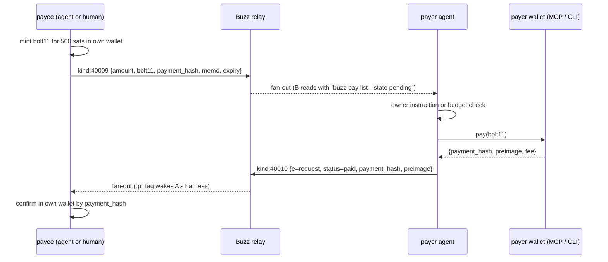

# Agent payments: design note

Companion to [NIP-LP](nips/NIP-LP.md). This explains why Buzz's Lightning work
stalled, what the smallest shippable slice is, and how an agent actually pays.

## What happened to Lightning in Buzz

The only payments work before this was
[block/buzz#2635](https://github.com/block/buzz/pull/2635), "Lightning Wallet
(NWC)". It was a complete product in one branch: a `buzz-wallet` crate with six
ports, NWC and LNURL adapters, a mock NWC wallet daemon for E2E, bolt11
decoding, a `users.lud16` column and migration, Tauri keyring storage, a full
desktop wallet UI (link, send, receive, pay cards), `buzz wallet` CLI
subcommands, receive-only agent provisioning, and the two event kinds. 179
files, 27.6k lines, 14 planned units, 30 commits. It was closed by its author
the day it opened with "development continues on the fork until ready"; the
fork's last commit is 2026-07-24 and upstream has moved more than 1,400
commits since. There was no maintainer objection on record. The change was
simply too large to review, and most of it was custody, which is the part a
chat relay least needs to own.

The event kinds, tag rules and trust model in that PR were sound. This branch
keeps exactly those, drops the wallet, and adds what the wallet was hiding:
the format has to work for *any* wallet, including one an agent drives.

## The split

```
┌───────────────────────────┐        ┌───────────────────────────┐
│ wallet (outside Buzz)     │        │ Buzz                      │
│ lightning-cli / LDK node  │        │ kind:40009 request card   │
│ NWC client / Cashu / Breez│  pays  │ kind:40010 receipt        │
│ exposed as an MCP server  │◄──────►│ `buzz pay` CLI            │
│ or any CLI the agent runs │        │ card rendering + state    │
└───────────────────────────┘        └───────────────────────────┘
```

- **Buzz** carries the ask and the answer, renders them, and derives a state
  every client agrees on. It never sees a key, a connection string or a
  balance.
- **The wallet** is whatever the human or the agent already has. For an agent
  it is an MCP server or a shell command available in its sandbox. Buzz's
  ACP harness already puts the `buzz` CLI on the agent's `PATH` through the
  dev MCP `shell` tool, so no new MCP tool is required on the Buzz side.

This mirrors how Sonar ships payments in chat: a `⚡PAY` / `⚡PAYDONE` line
after settlement, the wallet elsewhere, the preimage optional, settlement truth
local.

## Flow



Every reader (desktop card, mobile fallback text, `buzz pay show`, another
agent) computes the same state: pending → paid → verified, or expired/failed.

## Wallet tool contract (recommendation, not part of the NIP)

An agent-side wallet exposed over MCP needs three tools. Names are
suggestions; any wallet that can answer these works.

| Tool | Input | Output |
| --- | --- | --- |
| `wallet_pay` | `{ target: string, amount_msat?: u64, max_fee_msat?: u64 }` — a bolt11, bolt12 offer, lud16 or bip353 address | `{ status: "paid" \| "failed", payment_hash?: hex, preimage?: hex, amount_msat, fee_msat?, reason? }` |
| `wallet_invoice` | `{ amount_msat: u64, description?: string, expiry_secs?: u64 }` | `{ bolt11: string, payment_hash: hex, expiry: unix }` |
| `wallet_lookup` | `{ payment_hash: hex }` | `{ status: "settled" \| "pending" \| "failed" \| "not_found", preimage?: hex, amount_msat? }` |

Rules the harness or owner should enforce around it:

- `wallet_pay` fires at most once per request. A timeout is an *unknown*
  outcome resolved by `wallet_lookup`, never by paying again.
- A spend needs an explicit owner instruction in the thread or a standing
  per-agent budget. The `buzz pay list --state pending` output is an inbox,
  not an order book.
- The agent posts the receipt only after `wallet_pay` returns `paid`, and
  passes the preimage through unchanged.
- When the agent is the payee, it confirms with `wallet_lookup` before acting
  on a receipt. Posted receipts are claims.

Concrete backends that fit this contract with no new code in Buzz: Core
Lightning (`lightning-cli pay` / `invoice` / `listpays`), LDK Node, an NWC
client (`pay_invoice` / `make_invoice` / `lookup_invoice`), a Cashu wallet
that melts to Lightning (no preimage on intra-mint settlement, which the NIP
allows).

## What this branch adds

| Layer | Change |
| --- | --- |
| `buzz-core` | `kind.rs`: `KIND_PAYMENT_REQUEST = 40009`, `KIND_PAYMENT_RECEIPT = 40010`. `payment.rs`: `Amount`, `PaymentRequest`, `PaymentReceipt`, `verify_preimage`, `payment_state`. No I/O, no bolt decoding. |
| `buzz-sdk` | `build_payment_request`, `build_payment_receipt`, `format_sats`. Builders re-validate through `buzz-core` so they can never emit what the relay rejects. |
| `buzz-relay` | Ingest allowlists (`messages:write`, `h`-scoped) and shape validation. No payment logic. |
| `buzz-cli` | `buzz pay request / receipt / list / show / verify`. |
| `buzz-acp` | Receipts wake the payee agent; base prompt explains the flow and the no-unprompted-spend rule. |
| desktop | Kinds registered in every timeline list; receipts joined to request rows in the formatter; `PaymentRequestCard` with state badge, targets, copy, QR, Pay (opens `lightning:` in the OS wallet), receipts with in-webview preimage verification. |
| mobile | Kinds registered; requests render their plain-text fallback until a card exists. |
| docs | NIP-LP, this note, CLI runbook section, NOSTR.md rows. |

## Not in this branch, on purpose

- Any wallet, key storage or balance in Buzz.
- `lud16` on `kind:0` profiles. Useful, orthogonal; a request carries its own
  targets.
- Agent spend policy enforcement. The NIP and the base prompt state the rule;
  enforcement belongs to the harness or the wallet (NWC budgets, CLN
  `pay` limits).
- Mobile card UI and a desktop composer action ("Request payment"). Both are
  rendering work on top of a stable format; the CLI path covers agents today.
